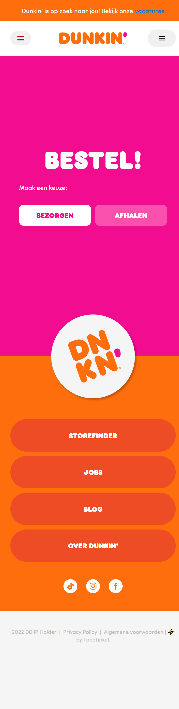

# Procesverslag
Markdown is een simpele manier om HTML te schrijven.  
Markdown cheat cheet: [Hulp bij het schrijven van Markdown](https://github.com/adam-p/markdown-here/wiki/Markdown-Cheatsheet).

Nb. De standaardstructuur en de spartaanse opmaak van de README.md zijn helemaal prima. Het gaat om de inhoud van je procesverslag. Besteedt de tijd voor pracht en praal aan je website.

Nb. Door *open* toe te voegen aan een *details* element kun je deze standaard open zetten. Fijn om dat steeds voor de relevante stuk(ken) te doen.

## Jij

  
uitwerken voor kick-off werkgroep

  ### Auteur:
  Cecilia van der Linde

  #### Je startniveau:
  Rood

  #### Je focus:
  Surface plane
 

## Je website

  
uitwerken voor kick-off werkgroep

  ### Je opdracht:
  https://www.dunkin.nl

  #### Screenshot(s) van de eerste pagina (small screen): 
  hier de naam van de pagina  
  

  #### Screenshot(s) van de tweede pagina (small screen):
  hier de naam van de pagina  
  
 

## Toegankelijkheidstest 1/2 (week 1)

  
uitwerken na test in 2e werkgroep

  ### Bevindingen
  Lijst met je bevindingen die in de test naar voren kwamen:
  
  De originele Dunkin website:

  - Geen h1
  - Geen omschrijving in de alt van afbeeldingen
  - Veel divs
  - Amper Buttons
  
  WCAG Checklist

  

## Breakdownschets (week 1)

  
uitwerken na afloop 3e werkgroep

  ### de hele pagina: 
  

  ### bestel pagina: 
  

  ### wellicht nog een dynamisch deel (bijv filter): 
  
<!--  -->

## Voortgang 1 (week 2)

  ### Verslag van meeting
  hier na afloop snel de uitkomsten van de meeting vastleggen

  Ik heb hier de punten van afgelopen week gebruikt aangezien ik geen gesprekken heb gehad tijdens de daadwerkelijke lessen.

  - HTML aanpassen
  - Buttons verkeerd gebruikt
  - Meer microinteracties toevoegen
  - Classes aan sections in de main geven

## Voortgang 2 (week 3)

  ### Verslag van meeting
  hier na afloop snel de uitkomsten van de meeting vastleggen

  - OL gebruiken ipv section bij de BestelOnline section
  - Manier vinden om huidige Taal en "Kies een Taal" aan te geven in de bijpassende button
  - Meer gebruik maken van de breakdown schets bij de tweede pagina
- Logische volgorde van items aanhouden

## Toegankelijkheidstest 2/2 (week 4)

  
uitwerken na test in 9e werkgroep

  ### Bevindingen
  Lijst met je bevindingen die in de test naar voren kwamen (geef ook aan wat er verbeterd is):

  - Buttons worden nu alleen gebruikt voor een verandering op de pagina zelf
  - Links worden gebruikt als er naar een andere pagina verwezen word
  - Semantisch correcte HTML
  - h1 toegevoegd op elke pagina
  - Logische volgorde van items in screenreader
  - Elke ingevulde alt dient als hulpmiddel voor het ondernemen van een actie.
  - Decoratieve plaatjes hebben lege alts
  - Er worden geen heading levels geskipt

  WCAG Checklist

  

## Eindgesprek (week 5)

  
uitwerken voor eindgesprek

  ### Je uitkomst - karakteristiek screenshots:
  

  

  ### Dit ging goed/Heb ik geleerd: 
  Ik heb eindelijk geleerd hoe ik grid goed kan gebruiken en hoe ik een custom cursor kan maken.

  ### Dit was lastig/Is niet gelukt:
De onderkant van de footer werkte niet goed mee op de bestel pagina.

  

## Bronnenlijst

  
continu bijhouden terwijl je werkt

  Nb. Wees specifiek ('css-tricks' als bron is bijv. niet specifiek genoeg). 
  Nb. ChatGpT en andere AI horen er ook bij.
  Nb. Vermeld de bronnen ook in je code.

  1. [bron 1](https://www.youtube.com/watch?v=U2R1SojkAYo)
  2. [bron 2](https://www.youtube.com/watch?v=jV8B24rSN5o)
  3. [bron 3](https://css-tricks.com/snippets/css/a-guide-to-flexbox/)

